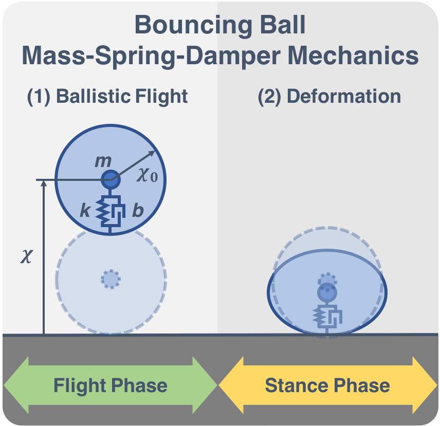
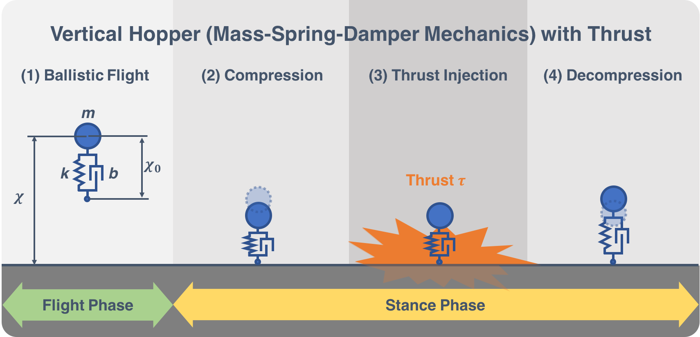
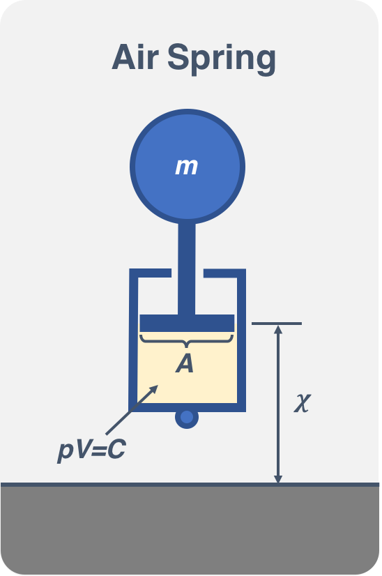
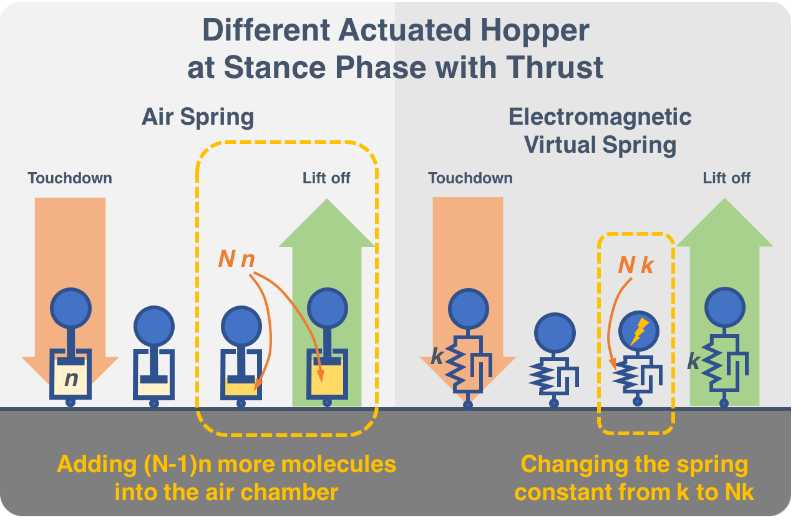
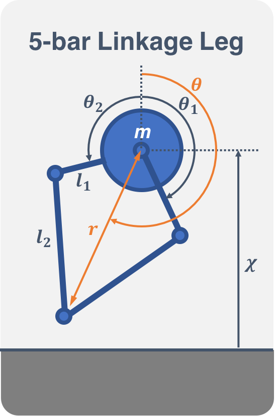

# BuildAHopper
Here's a step-by-step guide on how to create a hopper simulation using Matlab.
In the Matlab code, we will use $q$ instead of $\chi$, and $Q$ instead of $\mathbf{x}$ !

## Bouncing Ball (simplified mechanics)
To begin, let's consider a basic scenario involving a bouncing ball. 
Our goal is to replicate the motion of an elastic ball as it drops from a specific height and bounces back up. 
The ball exhibits ballistic behavior during flight, while the compression and release phases on the ground resemble a mass-spring-damper system.
Unfortunately, this is a complex problem that cannot be solved analytically and does not have a closed-form solution.

We will drop a ball with a radius of $\chi_0=0.05(\text{m})$ and a weight of $1(\text{kg})$ from a height of $1(\text{m})$. 
The ball will have a total potential energy of $E$ at the start. 
In the absence of a damper, the ball will continue to bounce endlessly and will not lose any energy.
Thus we assume that the ground absorbs a certain amount of energy each time the ball hits it and only returns a fraction (elastic efficiency $\gamma=0.8$) of the previous energy $E_1$, resulting in $E_2=\gamma E_1$ as the new system energy after each collision. 
We will also assume that the collision is instantaneous and ignore any deformations during that time.

> Write out the total energy of the system $E$. Next, determine the coefficient of restitution $\psi$, or the ratio of the velocity before the collision (represented as $\dot{\chi}_2$) to the velocity after the collision (represented as $\dot{\chi}_1$). In other words, find $\psi=-\dot{\chi}_2/\dot{\chi}_1$.

> Now construct its equation of motion as an initial value problem with a set of state-space representation $\dot{\mathbf{x}}=f(\mathbf{x})$ (first order ODEs) having different assigned velocity after every collision, where $\mathbf{x}=\left[\chi,\dot{\chi}\right]^T$

> We will now solve the equation of motion numerically using ODE45 from MatLab and plot the solution with respect to time.
> Modify the coefficient of restitution (param.rho) in `SimplifyBouncingBall.m` to see the result.

## Bouncing Ball (Mass-Spring-Damper mechanics)
Now let's revisit the bouncing ball problem in a more sophisticated matter. 
Remember that our ball exhibits ballistic behavior (1) in its flight phase and behaves like a mass-spring-damper system (2) in the stance phase. 

$m \ddot{\chi}=-m g$ (1)  
$m \ddot{\chi}+b \dot{\chi}+k (\chi-\chi_0)=-mg$ (2)

> Rewrite the equation of motion given from (1) and (2) into a dynamic system in its state-space representation $\dot{\mathbf{x}}=f(\mathbf{x})$ (first order ODEs) with initial values and carefully states the events, where $\mathbf{x}=\left[\chi,\dot{\chi}\right]^T$.

> The equation of motion looks more complicated now since this is a finite-state mechanism (hybrid system ).
> Given the properties of the ball: mass $m=1(\text{kg})$, rest length $\chi_0=0.05(\text{m})$, the spring constant $k=70000(\text{N/m})$, viscous damping coefficient $ b=15(\text{N s/m})$.
> Use the program `BouncingBall.m` to simulate the motion.

## Paddling (Juggling) Ball
We have discovered the motion of a bouncing ball when released from a specific height. 
The damper in the system consumes energy, causing the ball to eventually stop bouncing. 
However, we can inject energy into the system to counterbalance the energy consumed by the damper if we want the ball to bounce indefinitely. 

Imagine using a solid, flat paddle to propel an elastic ball upward. 
If we are skilled professionals and can make the ball land in the same position every time, we can apply a constant, uniform force from the moment the ball reaches its lowest point for a certain amount of time. 
By actively adding energy to the system through the force transmitted to the ball via the paddle, we can envision the ball bouncing to a constant height, perpetually, as long as we continue to provide the necessary energy.

> Let's convert the Equation of motion to a forced dynamic system using the format $\dot{\mathbf{x}}=f(\mathbf{x})+g(u)$, with $g(u)$ being the control law for this problem.
> We have a control law $u(t)$, which is a constant force $\tau$ that is applied uniformly for a specific time duration $\delta$ at the lowest point $\chi_b$.
> To be precise, $u(t)=\tau$ for $t\in(t_{b},t_{b}+\delta)$. We need to carefully define the initial conditions along with the above-mentioned conditions.

> Given the properties of the ball: mass $m=1(\text{kg})$, rest length $\chi_0=0.05(\text{m})$, the spring constant $k=70000(\text{N/m})$, viscous damping coefficient $ b=15(\text{N s/m})$.
> Assuming that $\tau=20(\text{N})$ for a sufficient duration $\delta = 0.005(\text{sec})$.
> Use the program `PaddlingBouncingBall.m` to simulate its motion.
> We should be able to observe the ball gradually bouncing toward a certain height.
> What is the necessary thrust $\tau$, measured in N, to maintain the hopper at a height of $h=1(\text{m})$?

## Active Hopper
Moving forward, let's shift our focus from the classic bouncing ball with paddle problem to examining the mechanics of a Pogo stick. 
Interestingly, both systems share the same equations of motion. 
The key difference lies in how we inject energy into the system. 
Instead of relying on the ground to transfer energy, we will utilize an actuator attached to the pogo stick. 
While muscle exertion is the primary actuator in living beings, artificial systems require a different approach; such as using motors, linear actuators, and pneumatic actuators to generate or dissipate energy. 

There are two popular methods for building a pogo stick - using a linear (coil) spring or a pneumatic spring. 
Pneumatic springs are capable of delivering more force to the system than linear springs and are ideal for tasks requiring higher loading. 
On the other hand, linear springs are more sensitive and have a higher bandwidth, making them a better choice for agile tasks. 
Since the mechanisms are different, control strategies also vary. 
In this context, we will simulate several actuator models to determine our control input $u(t)$ for different mechanisms.

### Linear spring with a linear actuator
First, we have the pogo stick with a linear spring. 
In this scenario, a theoretical linear actuator is added in parallel to the spring-damper system. 
This weightless linear actuator generates torques as needed and provides a constant force of $\tau$ for only $\delta=0.005(\text{sec})$, starting from the bottom of the stance phase.
As a result, our control law is similar to the ball-paddling problem.

> Apply the previous control strategy in the simulation with the given specifications and find a reasonable torque for the hopper to maintain the same height $h=1(m)$.
> Use the program `ActiveHopper.m` to simulate its motion.

### Pneumatic actuator
Next, we have the pogo stick with a pneumatic spring. 
When compressed, a pneumatic spring gains its springiness from compressing air or other gas. 
Assuming the gas in the spring is ideal and the temperature remains constant during compression, Boyle's law dictates that the pressure and volume have a constant product, expressed as $p V = C$.

> Find the air spring force law $F_{pneu}=f(\chi, V, A, p, C)$ that the pneumatic spring gives given the notations from the above figure. 

> If we were to inject gas into the air chamber at the lowest point of the stance phase, it would increase the stiffness of the spring and cause the pogo stick to jump up.
> To calculate the additional force produced by this action, we can use the ideal gas law $(p V=n R T)$ and assume that the number of gas molecules is multiplied by a factor of $N$ from the lowest point for a certain duration.
> Thus, we can express the additional force as $F_{add}=f(\mathbf{x}, V, A, p, C, N)$.

> We will set our control law to be $u=F_{add}$ from the lowest point to the take off point of the stance phase. The empirical system will not behave like a ideal gas and there will be heat loss during the compression. For a simplify version, we say that the heat loss also takes the form of the damper, that is, $b \dot{\mathbf{x}}$. Write down the equation of motions for the controlled system $\dot{\mathbf{x}}=f(\mathbf{x})+g(u)$. Apply the control strategy in the simulation with the given specifications and find a reasonable torque for the hopper to maintain the same height $h=1(\text{m})$.
>
> In order to control our system, we will use a control law where the force added, denoted by $F_{add}$, will be applied from the lowest point for a certain duration.
> It is important to note that the system will not behave like an ideal gas and heat loss will occur during compression.
> To simplify, we will consider the heat loss to be in the form of a damper, denoted by $b \dot{\mathbf{x}}$.
> The equation of motion for the controlled system can be expressed as $\dot{\mathbf{x}}=f(\mathbf{x})+g(u)$.
> By applying this control strategy in our simulation, we can find a reasonable torque for the hopper to maintain a constant height of $1$ meter, as specified.
> Use the program `ActivePneumaticHopper.m` to simulate its motion. Use the program `ActivePneumaticHopper2.m` to explore a different guard for this hybrid system.

### Electromagnetic Virtual Spring
In the previous model that used pneumatic technology, we observed the benefits of having a hopper with adjustable stiffness. 
The system's dynamics can be easily represented through the equation: $\dot{\mathbf{x}}=f(\mathbf{x},N)$. 
However, implementing a pneumatic spring in real-world scenarios poses difficulties due to the bulky and heavy nature of the pneumatic pump. 
But what if we could control the stiffness of a Hooke-law spring? 
What if a virtual Hooke-law spring could be constructed using an electromagnetic actuator? 
By manipulating the spring constant, we could effectively control the hopper and make it jump as we wish.

> Now assume that we have a stiffness-adjustable Hooke-law spring with a general spring constant $k$.
> Whenever the hopper reaches its lowest point, we'll change the spring constant to $N k$ for a duration of only $\delta=0.005(sec)$. The spring will then press up with a spring-loaded force, according to Hooke's law.
> Assume that we have a general damping term $b \dot{\mathbf{x}}$, causing the energy of the system to decay.
> We can then write out the equation of motions for the Electromagnetic Virtual Spring system.

> Apply the previous control strategy in `ActiveElectromagneticHopper.m` and find a reasonable torque for the hopper to maintain the same height $h=1m$.

## Active Five-bar-linkage Leg
So far, we've only examined a basic form of a hopper. 
This straightforward mass-spring-damper model is known as a "template" for a hopper, as it demonstrates the intended behavior [template paper]. 
We can now try to embed more joints and actuators into the system, like what a leg really could look like. 
This process is called anchoring, which may involve incorporating more actuators to strengthen the system or make it more feasible. 
The Electromagnetic Virtual Spring model hopper mentioned earlier in the previous chapter is challenging to implement as linear actuators are sluggish and bulky. 
Therefore, we need to anchor this design to a more practical mechanism.
Here we introduce the Minitaur leg (five-bar linkage), this is a good example of anchoring a simple hopper template into a more sophisticated mechanism. 
The two motors provide two degrees of freedom for this mechanism, in the radial direction and axial direction. 

> Find the kinematic mapping $f:(\theta_1,\theta_2)\rightarrow(r,\theta)$ between the angle of two motors to the radial direction and axial direction.

> To anchor our simple hopper template into the Minitaur leg, we will have to find the inverse kinematic of the system. Our goal is to express the two motor control inputs using the radius and angle of the simple hopper. This can be achieved through the function $g:(r,\theta)\rightarrow(\theta_1,\theta_2)$. Find the inverse kinematic of the system.

> Now, our attention will be on the vertical hopping while disregarding the radial movement.
> Let's assume that the two motors are symmetric, meaning $\theta_1=\theta_2=\xi$, so we can regulate the hopper's length by using a rotation input $\xi$.
> Please provide the kinematic mapping $f:\xi\rightarrow r$ and the inverse kinematic mapping $g:r\rightarrow\xi$.

> Now anchor the Electromagnetic virtual spring model onto the Minitaur leg model by finding what the control input should be using our inverse kinematic mapping.
> Use the program `ActiveFiveBarHopper.m` to simulate its motion.
