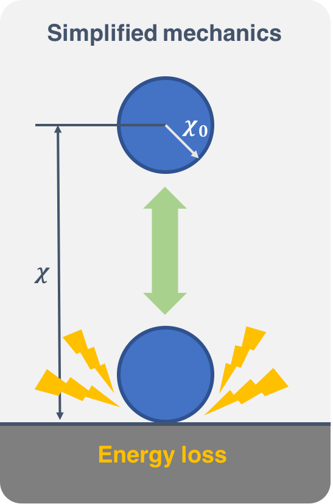

# BuildAHopper
Step by step guide to building a hopper simulation in MATLAB.

## Bouncing Ball (simplified mechanics)
To begin, let's consider a basic scenario involving a bouncing ball. 
Our goal is to replicate the motion of an elastic ball as it drops from a specific height and bounces back up. 
During its flight, the ball exhibits ballistic behavior, while the compression and release phases on the ground resemble a mass-spring-damper system.
Unfortunately, this is a complex problem that cannot be solved analytically and does not have a closed-form solution.

We release an elastic ball with radius &chi;_0=0.05m and mass m=1kg from a height h=1m, and the total energy of the ball at this initial point is $E$. If we don't have a damper in our system, we won't see any decrements in energy and the ball will bounce forever. Here we will make the naive assumption that the ground consumes a certain portion of energy every time the ball hits it, returning only a portion (elastic efficiency $\gamma=0.8$) of the previous energy $E_1$, that is, $E_2=\gamma E_1$, where $E_2$ is the new system energy after the collision. We also assume the collision happens in an instance and doesn't take any time at all, thus the deformation during that time is neglected.
